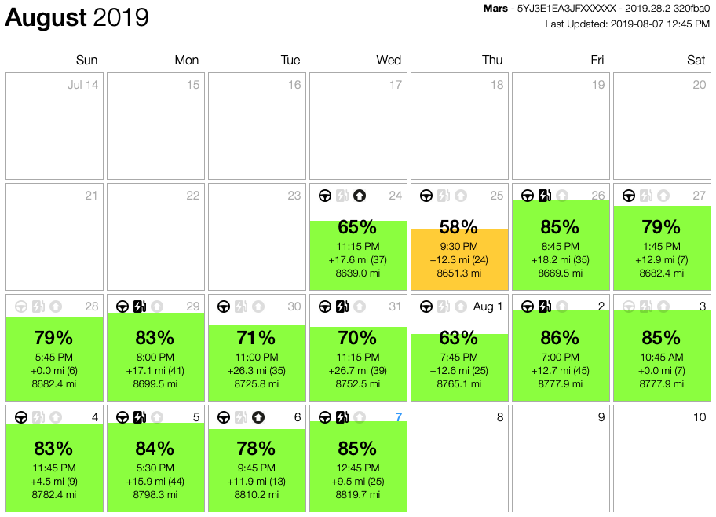

Tesla Data Logger
===

Fetch information from a Tesla vehicle through the unofficial Tesla API (https://www.teslaapi.io).

## Screenshot

A HTML file is generated to present a summary of the last 4 weeks of logs.



## Recommended Setup Procedures

I am using this on a Linux Mint 19 computer and I usually put all git repositories under `~/git`. So, the following instructions are how I set it up on my computer. Feel free to deviate for your own preferences. Open a Terminal, first thing is to install prerequisits, create the `git`-folder and clone the project through `git`. Then, you will get the folder `tesla-json-logger` after the successful clone.
```shell
sudo apt install python3 python3-requests python3-keyring python3-matplotlib
cd
mkdir git
cd git
git clone https://github.com/KarlZeilhofer/tesla-json-logger
```

Go in to the ~/git/tesla-json-logger folder, run the retrieval script once with verbose and write flags.
```shell
cd tesla-json-logger
python3 getStat.py -v -w
```
which will prompt you for your Tesla account username and password during the first run. The username and password will be stored for future use. Don't worry, they are not stored in plain text or insecurely. The macOS has a secure way to store these and that's what is used here. You can use the Keychain Access utility to remove them if you decided to do so, just search for `owner-api.teslamotors.com`.

Disclaimer: There is no warranty on this. Also, the software has not been tested extensively so it is very likely to contain bugs. If you encounter any, please let me know and I'll try my best to fix them.

## Cronjob

Use the _cronjob_ utility to schedule a periodical retrieval. Run `crontab`'s editor:
```shell
crontab -e
```
and add this line:
```
*/15 * * * *    python3 ${HOME}/git/tesla-logger/getStat.py -w
```


NOTE: Update the home path to reflect where you store the scripts.

After a few days, you would end up with a bunch of log files under ${HOME}/.config/tesla-logger/data/

```
.
├── 20190724
│   ├── 20190724-1245.json
│   ├── 20190724-1300.json
│   ├── 20190724-1315.json
│   ├── 20190724-1330.json
.
.
├── 20190725
│   ├── 20190725-0830.json
│   ├── 20190725-0845.json
│   ├── 20190725-0900.json
.
.
```

Congratulations, you are now logging the information from your Tesla vehicle.

## Generating HTML
To update the HTML file in `~/.config/tesla-logger` run the script with the update flag:
```shell
python3 getStat.py -u
```
